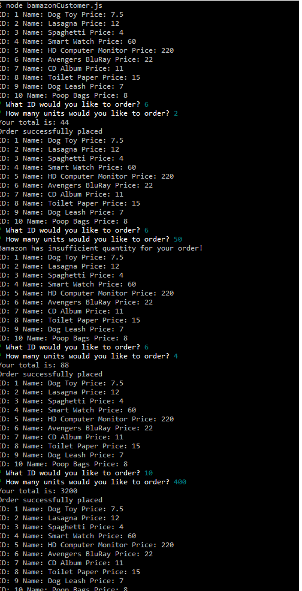

# bamazon
An Inquirer and MySQL based app that hold product information and prompts the user to select and order items.

bamazon will display the current products in the database.
It will prompt the user to choose an ID for the item that they wish to order.
Then it will prompt for a quantity.

bamazon will then take the user input and query the database. If the Item has sufficient stock_quantity it will remove the requested quantity from stock and display the total of the order.
If there isn't sufficient quantity, it will display `Bamazon has insufficient quantity for your order!` instead.

Please see the following image for examples:
